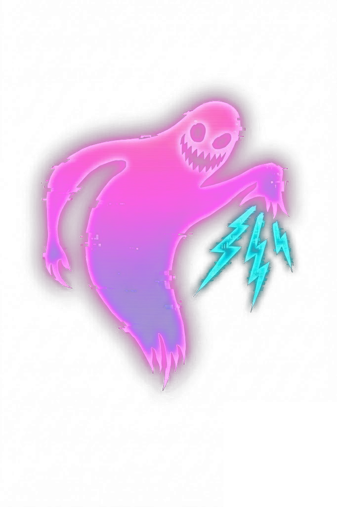
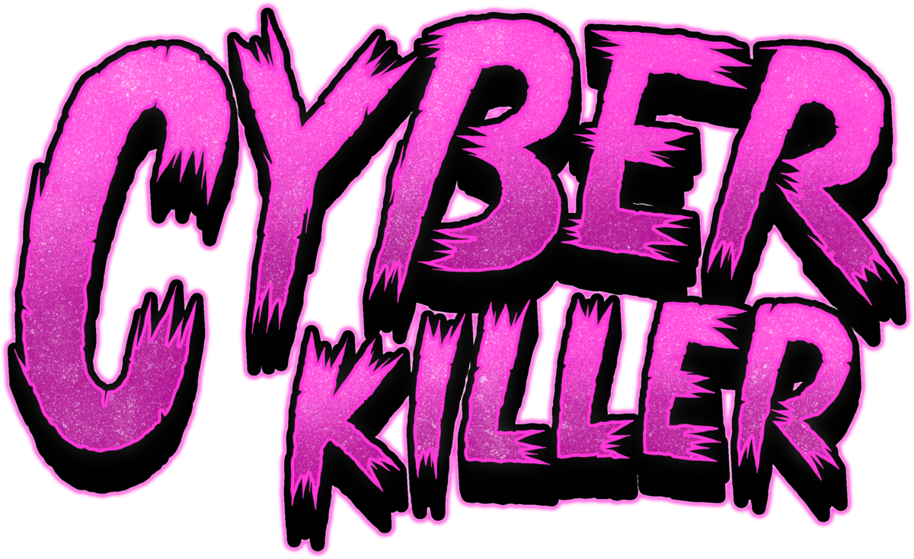

<p align="center">
  <br>
  
</p>

<p align="center"><b>Self-hosted King-of-the-Hill hacking arena. Free, open source, one command.</b></p>

<p align="center">
  Everything you like about TryHackMe King of the Hill - the live throne, the
  leaderboard, the scramble for root - on infrastructure <i>you</i> own, with
  <i>any</i> box you want, and <b>nothing for players to install</b>.
</p>

<p align="center">
  
  
  
  
  
</p>

---

You run it. Your team attacks it. Everyone hits the same boxes, races for **first
blood**, fights to **hold the throne** on each machine king-of-the-hill style, and
climbs a live leaderboard. You add targets (any Docker image - real CVEs, your own
builds, CTF boxes) and the platform scores captures automatically.

Drop in the bundled **MERIDIAN** scenario - a 10-box corporate Linux breach chain -
and you have a full red-team exercise running in one command.

## How it stacks up against TryHackMe KOTH

| | TryHackMe KOTH | **CyberKiller** |
|---|---|---|
| Hosting | Their cloud | **Your box** - run it on a laptop, a VPS, an air-gapped lab |
| Cost | Subscription | **Free**, AGPL-3.0 |
| Player client | Run their `koth` script to claim the king | **Nothing** - the server reads `/root/king.txt`; you claim it by writing to it as root |
| Boxes | Fixed set they ship | **Any Docker image** - registry reference or upload, flags auto-planted |
| Multi-box scenarios | One box at a time | **Designed chains** (bundled 10-box MERIDIAN pivot) *and* single hills |
| Scoring | Hold the king | Automated KOTH **plus** instructor-awarded user/root flags - your call |
| Privacy | Shared public servers | **Private** - your players, your network, your data |
| Stand up / tear down | n/a | `./deploy.sh` / `./deploy.sh delete` - one command each |

> **Heads up: this deploys deliberately vulnerable systems (real CVEs) and
> offensive tooling. Run it only in an isolated lab you control and are authorized
> to test - never expose the targets to the internet.** See [SECURITY.md](SECURITY.md).

Full setup, gameplay, player + admin walkthrough: **[docs/GUIDE.md](docs/GUIDE.md)**.

Licensed under the GNU AGPL-3.0 (see [LICENSE](LICENSE)).

## Why your team will actually use it

- 🎯 **Any box, in seconds.** Add a target by registry reference (`vulhub/...`, your
  own image, anything) or upload a `docker save` tarball. The platform spins it on
  the range and auto-plants a user + root flag - even for images that know nothing
  about CyberKiller.
- 👑 **Automated King of the Hill.** Flip any box to KOTH mode and the platform tracks
  the throne itself - whoever writes their handle to `/root/king.txt` (you need root to
  do it) holds the hill and earns points every tick, live. **No client to install** - unlike
  TryHackMe's KOTH, players don't run a `koth` agent; the control plane reads the throne
  server-side. Steal it by overwriting the file.
- 🏴 **Competitive by default.** A live leaderboard, first-blood bragging rights, throne
  timers, and steal announcements. It plays like a match, not a worksheet.
- 🧗 **Real chains, not isolated boxes.** MERIDIAN is a designed pivot: breach the
  DMZ, loot creds, hop inward to the next box, repeat to root the domain.
- 🔌 **Nothing to install for players.** No agent, no VPN client - they attack the
  boxes directly from their own Kali/Parrot VM.
- 🧑‍🏫 **You're in control.** Instructor console to spin/stop/reset targets, verify a
  capture against the planted flag, and award points. No rounds, no rotation - the
  range is up until you say otherwise.
- 🚀 **One command to stand up.** `./deploy.sh` - generates secrets, builds
  everything, prints the hub URL + an invite code. Tear it down or wipe it just as
  fast.

## Requirements

The host that runs the range:

- **Linux** with **Docker Engine** + the **Docker Compose plugin** (`docker compose`).
- A user that can talk to the Docker daemon (in the `docker` group or root).
- **~10 GB free disk** for the bundled images, and a couple of CPU cores / 4 GB RAM
  to run MERIDIAN's 10 boxes comfortably.
- Outbound internet on first run (to pull base images + Go modules). After that it
  can run offline.
- That's it - you do **not** need Go, Node, or anything else installed; the API is
  built inside a container by `deploy.sh`.

Each player attacks from their own VM (Kali, Parrot, etc.). In the default **LAN
mode** the targets attach to your physical network (ipvlan) and each box gets a
**real LAN IP**, so any machine on the LAN can `nmap` and connect straight away. A
**bridge mode** for single-host/cloud is one `.env` toggle away.

## Quick start

```bash
git clone <this-repo> cyberkiller && cd cyberkiller
./deploy.sh
```

`deploy.sh` generates `.env` (random secrets + this host's IP), builds the API and
the target images, brings up the stack, and prints the hub URL, the admin login, and
an invite code. The bundled MERIDIAN example comes up automatically.

### Ports

| Port | Service | Exposure | Override |
|------|---------|----------|----------|
| `3000/tcp` | Player hub (web) | host / LAN | `WEB_BIND` |
| `8080/tcp` | API | host / LAN (players' browsers + the hub hit it) | `API_BIND` |
| `3001/tcp` | Admin panel | **localhost only** - reach via SSH tunnel | `ADMIN_BIND` |
| `5432`, `6379` | Postgres, Redis | internal only (never published) | - |
| target IPs | the targets, on `ck-arena` | **LAN mode:** real LAN IPs (e.g. `192.168.1.200-223`), reachable from any machine. **Bridge mode:** `10.66.20.50-59`, host-local | `ARENA_MODE` |

All overridable in `.env`. For a domain + HTTPS deploy, point
`API_URL`/`CORS_ORIGINS` at your `https://` URL and put a reverse proxy (e.g.
Caddy, see `local/Caddyfile`) in front.

> **Reaching the targets:** in the default **LAN mode**, `deploy.sh` puts the
> targets on an ipvlan attached to your NIC, so each box gets a real LAN IP and
> any machine on the network reaches it directly - **no VPN, no routes, nothing
> for players to install**. Where ipvlan isn't available (cloud VPS), it falls back
> to **bridge mode** (private `10.66.20.0/24`, host-local). Either way the arena is
> isolated from the control plane: a rooted target reaches only other targets,
> never the API or DB.

### Managing the range

```bash
./deploy.sh            # bring it up (idempotent)
./deploy.sh update     # pull latest, rebuild, restart (keeps players + scores)
./deploy.sh teardown   # stop everything, keep data + images
./deploy.sh delete     # remove everything: containers, target images, volumes (DB)
```

## Adding a target

In the admin panel, open **Targets**:

1. **By reference** - enter a name, a Docker image (e.g. `vulhub/struts2:s2-045`),
   difficulty, and optionally the login password. The image is pulled and registered.
2. **By upload** - upload a `docker save` tarball for air-gapped or custom images.
3. Tick **Inject flags** for an arbitrary image that does not ship the CK entrypoint;
   the platform writes the two flags to the **paths you choose**. The box's own
   vulnerability is the foothold.
4. **Spin** it. It comes up on the range with a planted user flag and root flag.

Scoring is automatic (see Flags below); the Targets page also has a manual +User/+Root
override for adjudication. Reset or stop a target anytime.

## The MERIDIAN example

A fixed 10-box corporate Linux network (`docker/corp/`) with a designed
lateral-movement chain: breach the DMZ web box, then pivot inward with creds and keys
looted from each hop. See [docker/corp/CHAIN.md](docker/corp/CHAIN.md) for the full
breach map. It is enabled by default (`CORP_ORCHESTRATION=true`); set it to `false`
in `.env` to skip it and run a bare modular range.

## Flags

Every target has a **user** flag (foothold) and a **root** flag (root-only), at the
paths you set when you add the target (`user.txt` / `root.txt` by convention).

A player captures a flag by **writing their hub handle into the flag file** once they
have the required access. The control plane reads it server-side and **awards them
automatically** - no submission box, no instructor:

```bash
echo "yourhandle" > /path/to/user.txt   # foothold -> user flag
echo "yourhandle" > /root/root.txt        # root     -> root flag
```

First capture of each flag is first blood. (KOTH boxes use the same idea on
`/root/king.txt` for the live hold.)

## Layout

- `api/` - Go control plane (HTTP API, target engine, scoring)
- `web/` - player hub (Next.js)
- `admin/` - admin panel (Next.js)
- `docker/corp/` - the MERIDIAN example images
- `docker/vulnhub/`, `docker/targets/` - bundled CVE target images + the shared
  flag-plant entrypoint
- `local/` - compose helpers, target build scripts
- `deploy.sh`, `docker-compose.yml` - one-command self-host

## Architecture

Three services plus the targets, all on Docker:

- **Control plane** (`api/`, container `ck-control`) - a Go HTTP API backed by
  Postgres + Redis. It owns the target lifecycle: it talks to the host Docker
  daemon (the socket is mounted into this container only) to run target
  containers on the `ck-arena` bridge, and it installs iptables DNAT so each
  target answers on a fixed arena IP. It also serves the hub/admin APIs and
  scoring.
- **Player hub** (`web/`, `ck-web`) - the read-only player view: radar of live
  targets, leaderboard, activity, rules. Players don't authenticate to anything
  but the hub; they attack the targets directly over the network.
- **Admin panel** (`admin/`, `ck-admin`) - the instructor's console: add/spin/
  stop targets, award points, moderate. BasicAuth, bound to localhost (reach it
  over an SSH tunnel).
- **Targets** - one container per box on the isolated `ck-arena` network. A
  rooted target can reach only the other targets, never the control plane or DB.

Networks: `ck-net` (control plane + db + redis, private) and `ck-arena`
(targets only). Keeping them separate is the core isolation property - don't
merge them.

### How a target becomes scorable

1. The instructor adds an image to the catalog (`target_images` table) by
   registry reference or upload (`api/internal/targets/modular.go`).
2. `SpinImage` allocates a free arena IP from `ip_pool`, runs the container on
   `ck-arena` with a real arena IP, and plants a user + root flag. Images that ship
   the CK entrypoint (`docker/targets/entrypoint.sh`) get flags via the `CK_*` env
   vars; arbitrary images get them written to the operator-chosen paths over
   `docker exec` (`plantFlags`).
3. A scanner (`api/internal/koth`) reads each box's flag files for a player handle
   and auto-awards user/root captures (and the KOTH hold) through
   `api/internal/scoring`. `/admin/award` is a manual override.

## Extending / forking

- **Add your own targets at runtime** - no code needed. Use the admin Targets
  page (reference or upload). This is the normal path.
- **Bundle a new CVE image** - add `docker/vulnhub/<name>/` with a `Dockerfile`
  layering the shared overlay + a `ck-init.sh`, then register it in
  `local/build-all-target-images.sh`. Use `docker/vulnhub/apache-rce/` as the
  template. The overlay (`docker/targets/entrypoint.sh`) gives you sshd + the
  flag-plant contract for free.
- **Build a new multi-box scenario** - MERIDIAN (`docker/corp/` +
  `api/internal/corp/corp.go`) is the worked example: a fixed roster of boxes
  with creds/keys planted by each box's `ck-init.sh` so one hop unlocks the
  next. Copy that package, change the `Roster`, and seed the loot in each box's
  `ck-init.sh`. The credential/pivot map lives in `docker/corp/CHAIN.md`.
- **The flag-plant contract** is the one thing to respect: every target ends up
  with a user flag and a root flag on disk. Either inherit
  `docker/targets/entrypoint.sh` (reads `CK_USER_FLAG`/`CK_ROOT_FLAG`/
  `CK_ROOT_PASSWORD`) or tick "inject flags" and set the **User/Root flag path** to
  wherever they should live on that box.

## Development

```bash
# Go API (needs Go 1.24+, or just use deploy.sh which builds it in a container)
cd api && go build ./... && go vet ./...

# Frontends
cd web   && npm install && npm run build   # player hub
cd admin && npm install && npm run build   # admin panel

# Full stack locally
./deploy.sh                # build + run everything (generates .env)
docker logs -f ck-control  # API logs
```

The DB schema is `api/internal/db/schema.sql` (applied on boot) plus the
idempotent migrations in `api/internal/db/migrate.go`. The HTTP routes are all
registered in one place near the top of `api/cmd/server/main.go` - that's the
fastest way to see the whole API surface.
